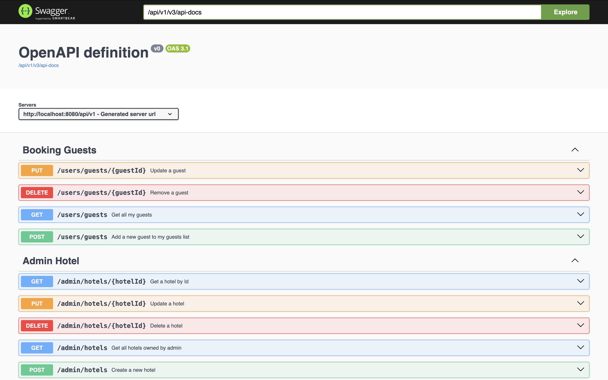
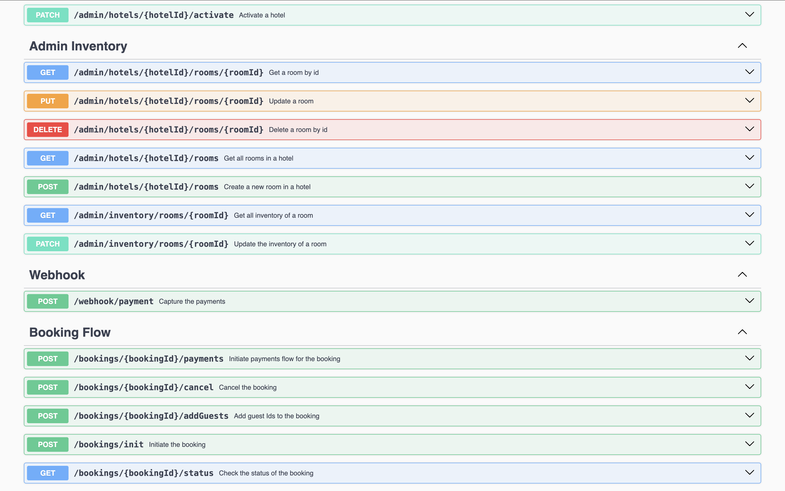
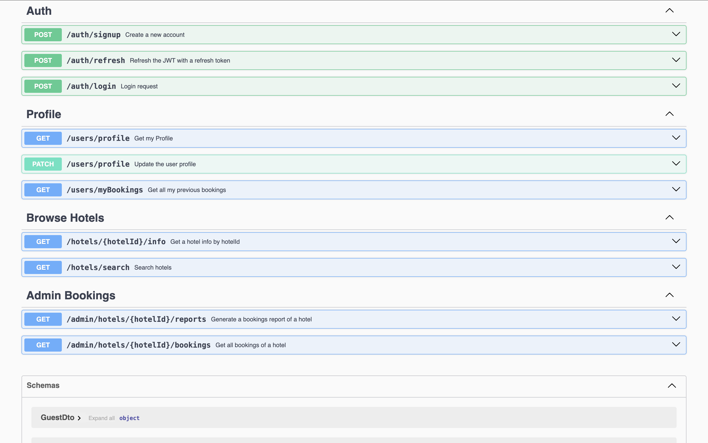
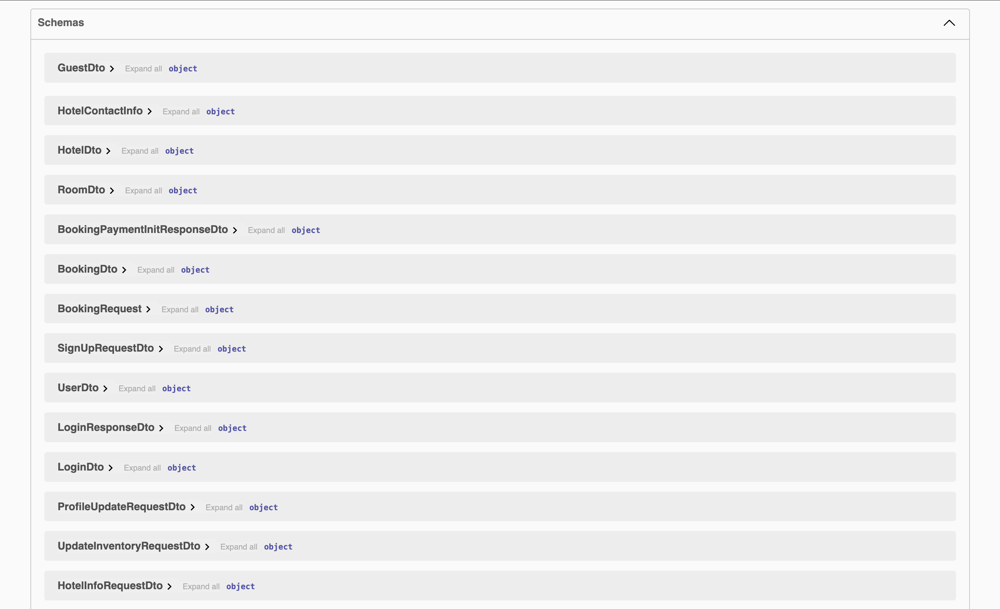
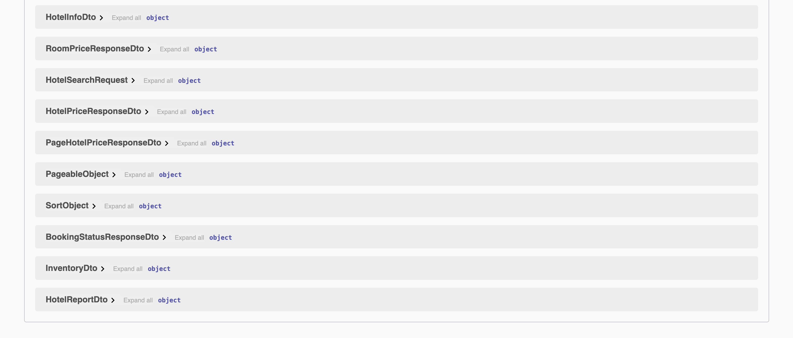

# Airbnb Clone Backend

This repository contains the backend service for the Airbnb Clone application. It is built with **Spring Boot**, utilizing **MVC concepts** within a **monolithic architecture**.

## Prerequisites

### For Any Setup:
* **Git:** To clone the repository.
* **Frontend Application:** The corresponding frontend service needs to be set up to interact with this backend. See [Frontend Repository](link-to-frontend-repo) (<- *Replace with actual link*).

### For Local Setup (Running the Codebase Directly):
* **JDK:** Java Development Kit (e.g., JDK 17 or later - *Specify exact version if known*).
* **Maven / Gradle:** The project's build tool (*Specify which one: Maven or Gradle*). Ensure it's installed or use the included wrapper (`mvnw` or `gradlew`).
* **PostgreSQL:** A running PostgreSQL server instance.

### For Quick Setup (Using Docker):
* **Docker & Docker Compose:** Installed and running. Download from [Docker's Official Website](https://www.docker.com/products/docker-desktop/).

---

## Local Setup (Running from Codebase)

Follow these steps to set up and run the backend service directly on your local machine:

1.  **Clone the Repository:**
    * Fork this repository (`https://github.com/tusaryan/airBnbApp`) on GitHub.
    * Clone your forked repository to your local machine:
        ```bash
        git clone [https://github.com/YOUR_GITHUB_USERNAME/airBnbApp.git](https://www.google.com/search?q=https://github.com/YOUR_GITHUB_USERNAME/airBnbApp.git)
        cd airBnbApp
        ```
    *(Replace `YOUR_GITHUB_USERNAME` with your actual GitHub username)*

2.  **Set Up PostgreSQL Database:**
    * Ensure you have PostgreSQL server installed and running locally.
    * Create a new database named `airBnb`. You can use tools like `psql`, pgAdmin, or your preferred database client:
        ```sql
        CREATE DATABASE airBnb;
        ```

3.  **Configure Application Properties:**
    * Open the main configuration file located at: `src/main/resources/application.properties`.
    * Update the following **datasource properties** with your local PostgreSQL credentials:
        * `spring.datasource.username`: Set this to your PostgreSQL username (e.g., `postgres`).
        * `spring.datasource.password`: Set this to your PostgreSQL password.
    * Verify the **frontend URL property**:
        * Check the value of `frontend.url` (e.g., `http://localhost:5173`).
        * Ensure this URL matches the exact address where your frontend application (`hotel-booking-app`) is running locally. You can typically find this URL in the terminal output when you start the frontend using `npm run dev`. Refer to the [Frontend Repository](link-to-frontend-repo) (<- *Replace with actual link*) for its setup details.
    * *(**Note on other property files:** The `application-docker.properties` file usually contains settings specific to the Docker Compose environment, like connecting to a PostgreSQL service defined within Docker. You generally **do not** need to modify it for a standard local setup.)*

4.  **Build and Run the Application:**
    * **Using IDE:** You can typically run the application directly from your IDE (like IntelliJ IDEA or VS Code) by finding the main application class (e.g., `AirBnbAppApplication.java`) and using the IDE's "Run" command.
    * **Using Build Tool Wrapper (Recommended):** Open a terminal in the project's root directory and use the Maven or Gradle wrapper:
        * **If using Maven:**
            ```bash
            ./mvnw spring-boot:run
            ```
        * **If using Gradle:**
            ```bash
            ./gradlew bootRun
            ```

5.  **Stopping the Local Server:**
    * If running via the terminal (`mvnw` or `gradlew`), press `Ctrl+C` in that terminal.
    * If running via your IDE, use the "Stop" button in the IDE's run/debug console.

---

## Quick Setup (Using Docker Compose)(may not work, will update it Later)

This guide helps you get the backend server running quickly using Docker Compose, ideal for isolated environments.

**⚠️ Important Note:** The `docker-compose.yml` file included in this repository might be slightly outdated due to recent API endpoint changes and may require adjustments for full functionality. It will be updated soon to reflect the latest configurations.

1.  **Navigate to Project Root:**
    Open your terminal or command prompt and change the directory to the root folder of this project where the `docker-compose.yml` file is located.

2.  **Ensure Docker is Running:**
    Verify that your Docker engine/daemon is running in the background.

3.  **Start the Services:**
    Execute the following command. This will build the Docker image (if it doesn't exist locally) and start the application container(s).
    ```bash
    docker-compose up
    ```
    *Tip: To run the containers in the background (detached mode), use `docker-compose up -d`.*

4.  **Stopping the Docker Server:**
    * If you ran `docker-compose up` directly in your terminal, press `Ctrl+C` in that same terminal window.
    * If you ran in detached mode (`-d`), use the following command in the project root directory:
        ```bash
        docker-compose down
        ```

---

## API Documentation (Swagger UI)

Once the backend server is running (either locally or via Docker), you can access the interactive API documentation powered by Swagger UI:

* **Default Swagger UI URL:** [http://localhost:8080/api/v1/swagger-ui/index.html#/](http://localhost:8080/api/v1/swagger-ui/index.html#/)

  *(Note: The port `8080` might differ if you have modified the configuration or if the port is already in use.)*

---

## API Endpoint Samples (Screenshots)

Here are some example screenshots from the Swagger UI demonstrating available API endpoints:

* **Example 1:**
  

* **Example 2:**
  

* **Example 3:**
  

* **Example 4:**
  

* **Example 5:**
  

*(Ensure the paths like `./public/swagger-ui-?.png` are correct relative to this README file and the images are present in the repository. Adjust paths if needed, e.g., `./docs/images/swagger-ui-1.png`)*